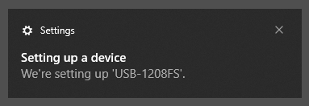
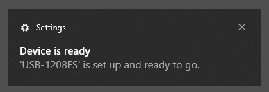
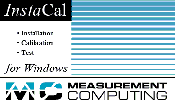
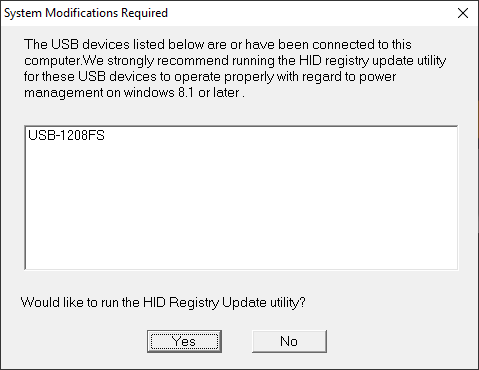
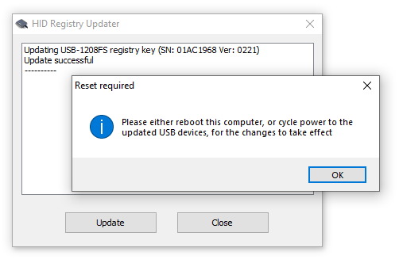
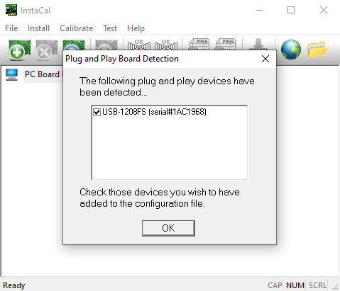
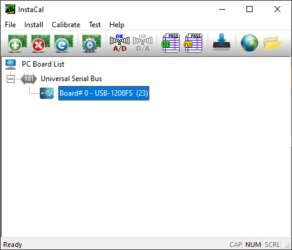

# First-time setup for USB devices

1. Run the installer (mccdaq.exe) if you haven't already.

1. Connect USB cable to the daq device and the PC.

1. Wait for Windows to say "Setting up a device".  
   

1. Wait for windows to say "Device is ready".  
   
   
1. Check if the device's indicator LED is on. If not, unplug the device then plug it back in. (It might be a good idea to do this even if the indicator LED is on.)

1. Launch InstaCal.  
   
    * Link to information about InstaCal: https://www.mccdaq.com/daq-software/instacal.aspx
    * Path to the InstaCal executable:
      > C:\Program Files (x86)\Measurement Computing\DAQ\inscal32.exe
    

1. InstaCal will show a dialog box titled "System Modifications Required". Click Yes.  
   

1. InstaCal closes itself and launches HID Registry Updater. It has a blank white rectangle.  
   
    * Link to information about HID Registry Updater: [HID Devices with Windows 8.1 & Windows 10](https://kb.mccdaq.com/KnowledgebaseArticle50499.aspx)
    * Path to the HID Registry Updater executable:
       > C:\Program Files (x86)\Measurement Computing\DAQ\HIDRegUpdater.exe

1. Click 'Update' button.

1. HID Registry Updater will say "Updating registry keys" and then "Update successful". Then HID Registry Updater will show a dialog box titled "Reset required".  
   

1. Click OK and then clock Close.

1. Reset the device by unplugging it and plugging it back in.

1. Launch InstaCal again.

1. InstaCal will show a dialog box titled "Plug and Play Board Detection". Click OK.
   
    * The configuration file they refer to is a text file here:
      > C:\ProgramData\Measurement Computing\DAQ\CB.CFG

1. The board will appear in InstaCal.  
   

1. Close InstaCal and run a JMCCUL example.