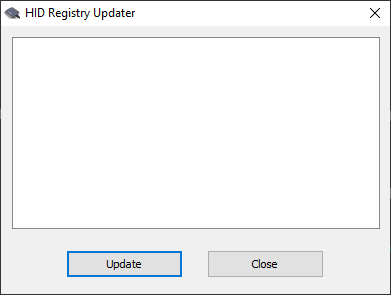

# First-time setup for DAQ devices 

Follow this guide each time a DAQ device is connected to a computer which it has not been previously connected to. It will walk you though some quirks of the hardware and software.

This is focused on DAQ devices which connect to a PC via USB. I don't know what setup is needed for other types of DAQ devices.

1. Run the Universal Library installer (mccdaq.exe) if you haven't already.

   1. When you launch the installer, first a WinZip prompt will appear, click OK.  
   

   1. Then the main WinZip window will appear, click Setup.  
   

   11. Now the installer actually appears:  
   
       * [DAQami](https://www.mccdaq.com/daq-software/DAQami.aspx) is nice for troubleshooting.
       * InstaCal & Universal Library is required.
       * [TracerDaq](https://www.mccdaq.com/daq-software/tracerdaq-series.aspx) is deprecated in favor of DAQami I think.
       * You may need to install the DirectX dependency.

1. Connect a USB cable to the DAQ device and the PC.

1. Wait for Windows to say "Setting up a device".  
   

1. Wait for Windows to say "Device is ready".  
   
   
1. Check if the device's indicator LED is on. If not, unplug the device then plug it back in.

1. Launch InstaCal.  
   
    * Link to information about InstaCal: https://www.mccdaq.com/daq-software/instacal.aspx
    * Path to the InstaCal executable:
      > C:\Program Files (x86)\Measurement Computing\DAQ\inscal32.exe
    

1. InstaCal will show a dialog box titled "System Modifications Required". Click Yes.  
   

1. InstaCal will close itself and launch HID Registry Updater. It is a window with a blank white rectangle.  
   
    * Link to information about HID Registry Updater: [HID Devices with Windows 8.1 & Windows 10](https://kb.mccdaq.com/KnowledgebaseArticle50499.aspx)
    * Path to the HID Registry Updater executable:
       > C:\Program Files (x86)\Measurement Computing\DAQ\HIDRegUpdater.exe

1. Click the Update button.

1. HID Registry Updater will say "Updating registry keys" and then "Update successful". Then HID Registry Updater will show a dialog box titled "Reset required".  
   

1. Click OK and then click Close.

1. Reset the device by unplugging it and plugging it back in.

1. Launch InstaCal again.

1. InstaCal will show a dialog box titled "Plug and Play Board Detection". Click OK.
   
    * The configuration file they refer to is a text file in this location:
      > C:\ProgramData\Measurement Computing\DAQ\CB.CFG

1. The board will appear in InstaCal.  
   

1. Close InstaCal then run [DeviceDiscoveryExample.java](src/main/java/xyz/froud/jmccul_examples/DeviceDiscoveryExample.java).
