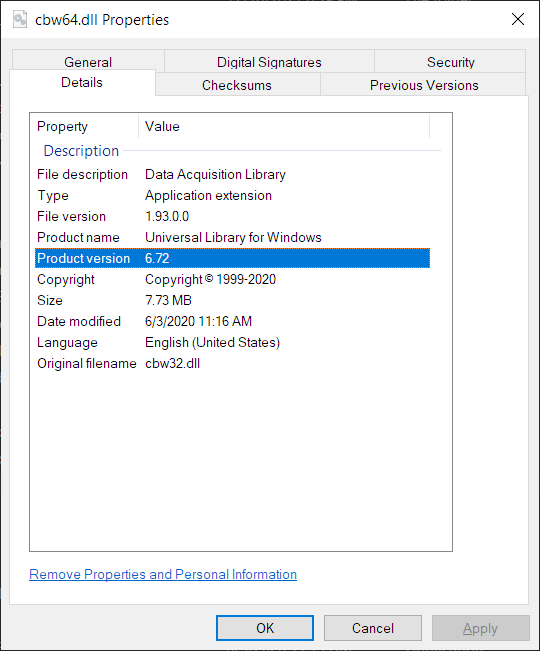
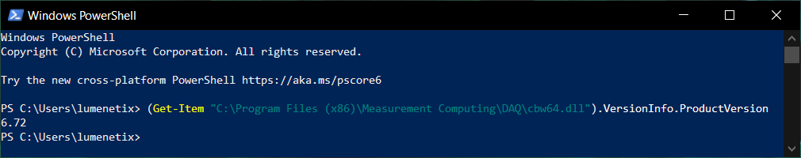
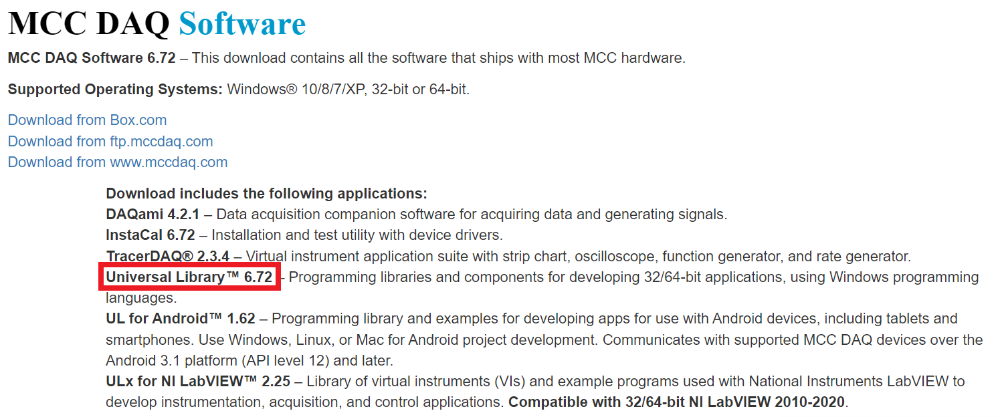

# How to check Universal Library version numbers

## How to check what version of UL is currently installed

Here are two ways, they should provide the same result.

### Check in header file

Open this file:

> C:\Users\Public\Documents\Measurement Computing\DAQ\C\cbw.h

then go to line 24 and look for this snippet:

``` C
/* Current Revision Number */
#define CURRENTREVNUM      6.7
```

### Check DLL version property

Open File Explorer and navigate to this folder:

> C:\Program Files (x86)\Measurement Computing\DAQ

Right click on file `cbw64.dll` and
click Properties. Go to the Details tab and look at the 'Product version' field:

<p align="center">
  
</p>

Or, open PowerShell and paste this command:

```powershell
(Get-Item "C:\Program Files (x86)\Measurement Computing\DAQ\cbw64.dll").VersionInfo.ProductVersion
```

Source for the PowerShell command: https://stackoverflow.com/a/13118517/7376577

Screenshot of the expected output:



## How to check what the newest version of UL is

Go to https://www.mccdaq.com/Software-Downloads.

Under the "MCC DAQ Software" heading, look for "Download includes the
following applications", then it will say something like:

> Universal Library™ 6.72 – Programming libraries and components for developing 32/64-bit applications, using Windows
> programming languages.

Screenshot of the webpage:



## How to check what version of UL is in a mccdaq.exe installer

Open the `mccdaq.exe` file in [7-Zip](https://www.7-zip.org/). Here are two ways to do that:

* Right-click on mccdaq.exe in Windows File Explorer then choose 7-Zip > Open Archive.
* Open "7-Zip File Manager" from the Start Menu. Navigate to mccdaq.exe then right-click on it and choose "Open Inside".

Once you've got mccdaq.exe open in 7-Zip:

1. Go into the folder called ICalUL.
2. Right-click on file ICalUL.msi and choose 'Open Inside'.
3. Right-click on file Data1.cab and choose 'Open Inside'.
4. Then you can:
    * Right-click on cbw.h and choose View, then look for `#define CURRENTREVNUM` in the .h file as described above.
    * Copy cbw64.dll out of the .cab file, then view the properties of the DLL file as described above.