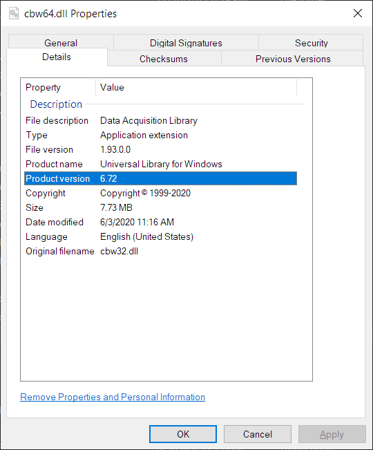
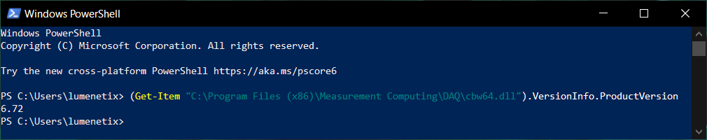
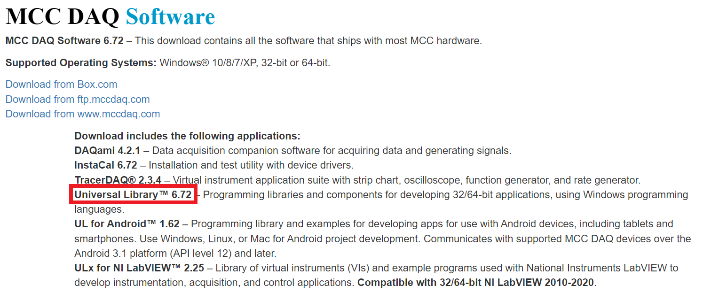

# SHow to check UL version numbers

## How to check what version of UL is currently installed

### Check in header file 

Open file "C:\Users\Public\Documents\Measurement Computing\DAQ\C\cbw.h" and look for this on line 24:

``` C
/* Current Revision Number */
#define CURRENTREVNUM      6.7
```

### Check DLL version property

Open file explorer and navigate to "C:\Program Files (x86)\Measurement Computing\DAQ". Right click on cbw64.dll and click Properties. Go to the Details tab and check the 'Product version' field:



Or open PowerShell and paste this command:

```powershell
(Get-Item "C:\Program Files (x86)\Measurement Computing\DAQ\cbw64.dll").VersionInfo.ProductVersion
```

Source for the PowerShell command: https://stackoverflow.com/a/13118517/7376577

Screenshot:



## How to check what the newest version of UL is

Go to https://www.mccdaq.com/Software-Downloads. Under the "MCC DAQ Software" heading, look for "Download includes the following applications", then it will say something like:

> Universal Library™ 6.72 – Programming libraries and components for developing 32/64-bit applications, using Windows programming languages.

Screenshot:



## How to check what version of UL is in an mccdaq.exe installer

Open the mccdaq.exe file in 7-Zip. Here are two ways to do that:

* Right-click on mccdaq.exe then choose 7-Zip > Open Archive.
* Open "&-Zip File Manager" from the Start Menu. Navigate to mccdaq.exe right-click and choose "Open Inside".

Once you've got the file open in 7-Zip:

1. Go into the folder called ICalUL.
2. Right-click on file ICalUL.msi and choose 'Open Inside'.
3. Right-click on Data1.cab and choose 'Open Inside'.
4. Then you can:
   * Right-click on cbw.h and choose View, and look for `CURRENTREVNUM` as described above.
   * To view the Product Version field of cbw64.dll, I think you need to copy the dll file out of the cab.