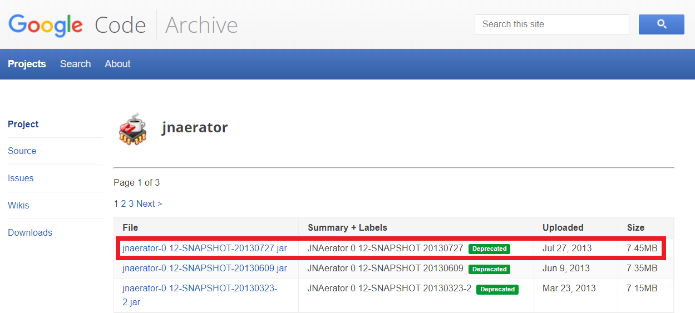

# Information about JNA and JNAerator

JNA stands for [Java Native Access](https://github.com/java-native-access/jna). JNA is a Java library which lets you use native shared libraries in Java programs. Native shared libraries are `.dll`, `.so`, and `.dylib` files.

[JNAerator](https://github.com/nativelibs4java/JNAerator) is a tool which generates Java bindings for JNA.

## How to download JNAerator

It appears JNAerator was originally hosted on Google Code and has been partly migrated to GitHub.

The [GitHib repository](https://github.com/nativelibs4java/JNAerator) does not have any ready-to-use jar files. Instead, you can download them from the [Google Code archive](https://code.google.com/archive/p/jnaerator/downloads).

It appears the latest version available on Google Code is "jnaerator-0.12-SNAPSHOT-20130727.jar", even though it is marked deprecated.

Screenshot of the Google Code page:



## How to run JNAerator

Run this command:

```shell
java -jar path/to/jnaerator-0.12-SNAPSHOT-20130727.jar -library MeasurementComputingUniversal -mode Directory -runtime JNA -package xyz.froud.jmccul -o outputDirectory "C:\Users\Public\Documents\Measurement Computing\DAQ\C\cbw.h"
```

Explanation of the JNAerator options used:

* `-library MeasurementComputingUniversal`: sets the name of the generated file to "MeasurementComputingUniversalLibrary.java".
* `-mode Directory`: outputs a directory of Java source code files, instead of compiling them into a jar.
* `-runtime JNA`: use JNA instead of [BridJ](https://github.com/nativelibs4java/BridJ).
* `-package xyz.froud.jmccul`: adds a `package` statement to the top of the generated Java files, and creates subdirectories for each part of the package name.
* `-o outputDirectory`: put all the output files in a folder called `outputDirectory`.

For the list of all available JNAerator options, visit the wiki page on GitHub called [Command Line Options And Environment Variables](https://github.com/nativelibs4java/JNAerator/wiki/Command-Line-Options-And-Environment-Variables).

## Output

### Command-line output

The expected command-line output is something like this:

```
Auto-configuring parser...
Parsing native headers...
Normalizing parsed code...
Generating libraries...
Generating DaqDeviceDescriptor.java
Generating MeasurementComputingUniversalLibrary.java
#
# SUCCESS: JNAeration completed !
# Output mode is 'Directory(Bindings sources in simple file hierarchy)
#
# => 'C:\path\to\outputDirectory'
#
```

If you have Visual Studio and/or a Windows SDK installed, you may see more output like this:

```
Oct 24, 2022 6:54:15 PM com.ochafik.admin.visualstudio.VisualStudioUtils getProp
INFO: [environment] ProgramFiles(x86)=C:\Program Files (x86)
Oct 24, 2022 6:54:15 PM com.ochafik.admin.visualstudio.VisualStudioUtils getProp
INFO: [environment] VISUAL_STUDIO_HOME=C:\Program Files (x86)\Microsoft Visual Studio 9.0
Oct 24, 2022 6:54:15 PM com.ochafik.admin.visualstudio.VisualStudioUtils getProp
INFO: [environment] ProgramFiles(x86)=C:\Program Files (x86)
Oct 24, 2022 6:54:15 PM com.ochafik.admin.visualstudio.VisualStudioUtils getProp
INFO: [environment] WINDOWS_SDK_HOME=C:\Program Files (x86)\Microsoft SDKs\Windows\v6.0A
Oct 24, 2022 6:54:15 PM com.ochafik.admin.visualstudio.VisualStudioUtils getProp
INFO: [environment] VISUAL_STUDIO_INCLUDES=C:\Program Files (x86)\Microsoft Visual Studio 9.0\VC\include;C:\Program Files (x86)\Microsoft SDKs\Windows\v6.0A\Include
```

You can ignore errors about JNAerator not being able to find `windows.h` or `time.h`:

```
C:\Users\Public\Documents\Measurement Computing\DAQ\C\cbw.h:14:0: error: File not found: windows.h in C:\Program Files (x86)\Microsoft Visual Studio 9.0\VC\include C:\Program Files (x86)\Microsoft SDKs\Windows\v6.0A\Include .
C:\Users\Public\Documents\Measurement Computing\DAQ\C\cbw.h:14:0: error: File not found: time.h in C:\Program Files (x86)\Microsoft Visual Studio 9.0\VC\include C:\Program Files (x86)\Microsoft SDKs\Windows\v6.0A\Include .
```

### File output

JNaerator will create these two Java files:

* `outputDirectory/xyz/froud/jmccul/MeasurementComputingUniversalLibrary.java`
* `outputDirectory/xyz/froud/jmccul/DaqDeviceDescriptor.java`

## Post-processing

### Remove deprecated methods

For simple cases, JNAerator produces one Java method signature for each C function. But if a C function involves pointers, JNAerator produces two Java method signatures, one marked `deprecated` and one not.

Here's a simplified example. This is the function prototype for [`cbDIn()`](https://www.mccdaq.com/pdfs/manuals/Mcculw_WebHelp/hh_goto.htm?ULStart.htm#Function_Reference/Digital_IO_Functions/cbDIn.htm):

```C
int cbDIn(int BoardNum, int PortType, unsigned short *DataValue);
```

JNAerator outputs:

```java
/**
 * @deprecated Use the safer methods cbDIn(int, int, java.nio.ShortBuffer) and cbDIn(int, int, com.sun.jna.ptr.ShortByReference) instead.
 */
@Deprecated 
int cbDIn(int BoardNum, int PortType, ShortByReference DataValue);

int cbDIn(int BoardNum, int PortType, ShortBuffer DataValue);
```

(Confusingly, the `@deprecated` Javadoc tag suggests two safer alternative methods, but the second suggestion is the deprecated method.)

I want to remove all the deprecated methods. According to [Command Line Options And Environment Variables](https://github.com/nativelibs4java/JNAerator/wiki/Command-Line-Options-And-Environment-Variables), this JNAerator option should work:

> * -skipDeprecated  
> Don't generate members that would be tagged as @Deprecated

But the JNAerator jar I'm using doesn't recognize that option and will not run if I add it.

Instead, I replaced all matches of the crazy regular expression below with an empty string.

```regex
\/\*\*\s+\*[\w\s:<>\(\),\*\/\\\.@\{\#\}]+@deprecated\s+int \w+\([\w ,\.]+\);
```

Link to try the regular expression: https://regexr.com/6bokv

### Add helper method for `Structure.ByValue`

For the [`DaqDeviceDescriptor`](https://www.mccdaq.com/pdfs/manuals/Mcculw_WebHelp/hh_goto.htm?ULStart.htm#Function_Reference/Device-Discovery/DaqDeviceDescriptor-type.htm) struct, JNAerator generates a class with two empty subclasses:

```java
public class DaqDeviceDescriptor extends com.sun.jna.Structure {

    // struct stuff here

    public static class ByReference extends DaqDeviceDescriptor implements Structure.ByReference {
    };

    public static class ByValue extends DaqDeviceDescriptor implements Structure.ByValue {
    };
}
```

[The Javadoc for `com.sun.jna.Structure`](http://java-native-access.github.io/jna/5.12.1/javadoc/com/sun/jna/Structure.html) says:

> When used as a function parameter or return value, [the `Structure` class] corresponds to `struct*`.... The tagging interfaces `Structure.ByReference` and `Structure.ByValue` may be used to alter the default behavior.

The `ByReference` subclass is not used in JMCCUL and can be removed from DaqDeviceDescriptor.java.

The `ByValue` subclass is used twice, as parameters for the [`cbCreateDaqDevice()`](https://www.mccdaq.com/pdfs/manuals/Mcculw_WebHelp/hh_goto.htm?ULStart.htm#Function_Reference/Device-Discovery/cbCreateDaqDevice.htm) and [`cbGetBoardNumber()`](https://www.mccdaq.com/pdfs/manuals/Mcculw_WebHelp/hh_goto.htm?ULStart.htm#Function_Reference/Device-Discovery/cbGetBoardNumber.htm) functions.

The original Universal Library signatures of those functions are:

```C
int cbCreateDaqDevice(int BoardNum, DaqDeviceDescriptor deviceDescriptor);

int cbGetBoardNumber(DaqDeviceDescriptor DeviceDescriptor);
```

The `DaqDeviceDescriptor` parameters are not pointers so JNAerator generates:

```java
int cbCreateDaqDevice(int BdNum, DaqDeviceDescriptor.ByValue DeviceDescriptor);

int cbGetBoardNumber(DaqDeviceDescriptor.ByValue DeviceDescriptor);
```

Everywhere else uses `DaqDeviceDescriptor` with no tagging interface, and I had a hard time figuring out how to convert to `DaqDeviceDescriptor.ByReference`. (If you try to cast it it'll throw a ClassCastException.) I found [these](https://stackoverflow.com/a/26309505) [two](https://github.com/java-native-access/jna/issues/691#issuecomment-242814602) comments which say to first call `getPointer()` and then either:

* use the [`Structure` constructor which accepts a `Pointer` parameter](http://java-native-access.github.io/jna/5.12.1/javadoc/com/sun/jna/Structure.html#Structure-com.sun.jna.Pointer-), or
* call the [static `Structure.newInstance()` method](http://java-native-access.github.io/jna/5.12.1/javadoc/com/sun/jna/Structure.html#newInstance-java.lang.Class-com.sun.jna.Pointer-).

Using the constructor would require adding constructors to `DaqDeviceDescriptor` and the `ByValue` subclass which is annoying, so I chose to use the `newInstance()` method instead.

The [Javadoc for the `getPointer()` method](http://java-native-access.github.io/jna/5.12.1/javadoc/com/sun/jna/Structure.html#getPointer--) warns:

> if you use the structure's pointer as a function argument, you are responsible for calling `write()` prior to the call and `read()` after the call. These calls are normally handled automatically by the `Function` object when it encounters a `Structure` argument or return value.

And indeed if you don't call [`read()`](http://java-native-access.github.io/jna/5.12.1/javadoc/com/sun/jna/Structure.html#read--) after calling `Structure.newInstance()`, then `cbCreateDaqDevice()` will fail with error code 306. [cbGetErrMsg()](https://www.mccdaq.com/pdfs/manuals/Mcculw_WebHelp/hh_goto.htm?ULStart.htm#Function_Reference/Error_Handling_Functions/cbGetErrMsg.htm) says "Error number 306 has no text" but cbw.h reveals:

```c
/* Internal errors returned by 32 bit library */
...
#define CREATE_BOARD_FAILURE    306   /* 32 bit - failed to create board */
```
